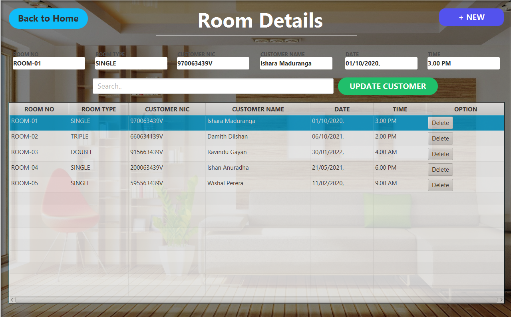

# Blue_Ocean-Hotel_Reservation_System
A hotel reservation system allows a guest to plan their own trip at their convenience. It is a software tool that displays your live rates and inventory in real time, across all of your channels, and allows guests to select the dates for their trip and finalise their reservation.

## Description

#### This Application is single Alone Application.And this Application developed for solving some problems of Hotel_Reservation_System and gives best Efficient service for them

## Main Functions of Application
* Login Interface
* Admin DashBoard Interface
* Reception DashBoard Interface
* Room Details Interface
* Meals Plans Interface
* Manage Income Interface
* Reserve Rooms Interface
* Maintain Room Interface

#### Also,This Application Optimized to Provide for Desktop Devices.

## :link: Basic Background of Application

### 🌱 Login Interface

### 🌱 Admin DashBoard Interface

### 🌱 Reception DashBoard Interface

### 🌱 Room Details Interface

### 🌱 Meals Plans Interface

### 🌱 Manage Income Interface

### 🌱 Reserve Rooms Interface

### 🌱 Maintain Room Interface

## Technology/Framework used
* javaFX
* Java
* CSS

## License
**Copyright @ 2022 All Right Reserved By Ishara Maduranga**
